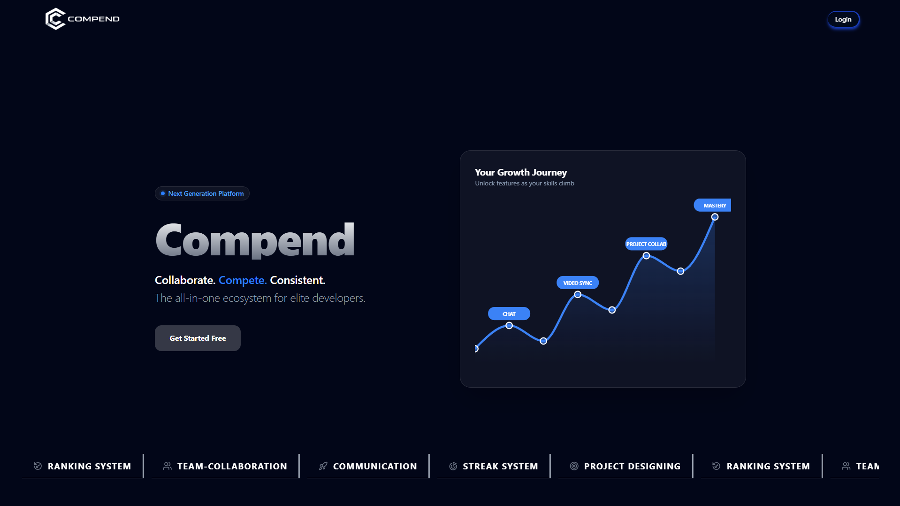

# Compends

<!-- Landing Page Screenshot -->
<!-- Replace the placeholder below with your actual landing page image -->


---

## Overview

Compends is a community-driven platform built specifically for college students. It brings together real-time communication, collaborative project planning, competitive ranking, and curated learning resources into a single unified environment. Students can connect with peers, build communities, track their technical growth, and stay informed about opportunities in the tech ecosystem.

---

## Features

### Community and Real-Time Chat

Students can create and join communities centered around shared interests, courses, or projects. Within each community, members can communicate instantly through real-time messaging powered by Supabase, ensuring a seamless and low-latency chat experience.

### Video Calling and Screen Sharing

Compends integrates LiveKit to enable high-quality peer-to-peer and group video calling. Members can share their screens during calls, making it practical for collaborative coding sessions, study groups, and project discussions.

### Collaborative Project Wireframing with AI

Communities can plan and visualize projects together using an integrated Tldraw canvas. The whiteboard experience is enhanced with Gemini AI, allowing members to generate suggestions, auto-complete designs, and receive intelligent assistance while building wireframes collaboratively.

### Developer Ranking System

Each community member has a public ranking profile derived from their activity on external platforms. Compends fetches GitHub and LeetCode statistics to compute a holistic developer score, encouraging healthy competition and recognizing technical contributions within the community.

### Hackathon Discovery

The platform aggregates and displays the latest hackathons from across the tech ecosystem. This feed is accessible to all community members, making it easy to discover opportunities, form teams, and participate in events together.

### Blog Writing

Members can author and publish blog posts within the platform. This encourages knowledge sharing, technical writing, and peer learning, giving students a space to document their experiences and insights for the broader community.

### Curated YouTube Integration

Compends includes an embedded YouTube experience where members can watch videos relevant to their career growth. The integration focuses on surfacing meaningful content in areas such as programming, software development, open source, and professional development.

---

## Tech Stack

| Layer | Technology |
|---|---|
| Frontend Framework | React.js (JavaScript) |
| Authentication | Clerk (with Supabase JWT Template) |
| Backend as a Service | Supabase (Database, Realtime, Storage) |
| Video Calling | LiveKit |
| Collaborative Canvas | Tldraw |
| Artificial Intelligence | Google Gemini |
| Data Fetching | GraphQL (LeetCode stats) |
| UI Components | shadcn/ui |
| Styling | Tailwind CSS |
| Animations | Framer Motion |

---

## Getting Started

### Prerequisites

- Node.js (v18 or above)
- A Supabase project with realtime and row-level security enabled
- A Clerk application with the Supabase JWT template configured
- LiveKit server credentials
- Gemini API key
- Tldraw license key

### Installation

```bash
# Clone the repository
git clone https://github.com/your-username/compends.git

# Install frontend dependencies
cd compends/frontend
npm install

# Install backend dependencies
cd ../backend
npm install
```

### Environment Variables

Since the project is split into two separate directories, each has its own environment configuration.

**`frontend/.env`**

```env
# Supabase
VITE_SUPABASE_URL=your_supabase_url
VITE_SUPABASE_ANON_KEY=your_supabase_anon_key
VITE_SUPABASE_SERVICE_ROLE_KEY=your_supabase_service_role_key

# Clerk Authentication
VITE_CLERK_PUBLISHABLE_KEY=your_clerk_publishable_key

# LiveKit
VITE_LIVEKIT_URL=your_livekit_server_url
VITE_LIVEKIT_API_KEY=your_livekit_api_key
VITE_LIVEKIT_API_SECRET=your_livekit_api_secret

# Gemini AI
VITE_GEMINI_API_KEY=your_gemini_api_key

# Tldraw
VITE_TLDRAW_LICENSE=your_tldraw_license_key

LIVEKIT_API_KEY=your_livekit_api_key
LIVEKIT_API_SECRET=your_livekit_api_secret
```

**`backend/.env`**

```env
SUPABASE_URL=your_supabase_url
```

### Running the Development Server

```bash
# From the frontend directory
cd frontend && npm run dev

# From the backend directory (in a separate terminal)
cd backend && npm run start
```

The frontend will be available at `http://localhost:5173` and the backend server at `http://localhost:10000` by default.

---

## Project Structure

```
compends/
├── backend/
│   ├── routes/            # API route handlers
│   ├── .env
│   └── server.js           # Backend entry point
│
└── frontend/
    ├── public/
    ├── src/
    │   ├── components/    # Reusable UI components (shadcn/ui based)
    │   ├── pages/         # Application pages and routes
    │   ├── features/      # Feature modules (chat, video, canvas, ranking, etc.)
    │   ├── hooks/         # Custom React hooks
    │   ├── lib/           # Supabase client, Clerk setup, GraphQL queries
    │   ├── utils/         # Helper functions and utilities
    │   └── main.jsx       # Frontend entry point
    ├── .env
    ├── tailwind.config.js
    └── package.json
```

---

## Authentication

Compends uses Clerk as the primary authentication provider, integrated with Supabase via the official Clerk Supabase JWT Template. When a user signs in through Clerk, a signed JWT is issued and passed to Supabase as the bearer token. Supabase row-level security policies are configured to verify this token, ensuring that database access is scoped strictly to the authenticated user. This approach removes the need to manage passwords or sessions manually while keeping Supabase's fine-grained access control fully functional.

---

## Challenges and Solutions

### LiveKit Token Generation Behind a Reverse Proxy

One of the more technically involved challenges was enabling secure LiveKit room access from the frontend without exposing the LiveKit API secret to the client. LiveKit requires a signed JWT token generated server-side using both the API key and API secret before a user can join a room.

The solution was to introduce a lightweight backend server that acts as a reverse proxy. When a user initiates a video call, the frontend sends a request to the backend with the room name and user identity. The backend signs the token using the LiveKit API secret, which is stored exclusively as a server-side environment variable, and returns the short-lived token to the client. The frontend then uses this token directly with the LiveKit client SDK to connect to the room.

This architecture ensures the API secret is never exposed in the browser, prevents unauthorized room access, and keeps the token lifecycle short and auditable. It also made it straightforward to add identity validation middleware before token issuance, so only authenticated Clerk users can obtain a valid LiveKit token.

### LeetCode GraphQL Rate Limiting and CORS

LeetCode does not provide an official public API. Fetching user statistics requires querying their internal GraphQL endpoint, which enforces strict CORS policies and rate limits when called from a browser directly. Routing these requests through the backend server resolved the CORS restriction, and request caching on the server side was used to stay within acceptable rate limits while serving ranking data to multiple community members simultaneously.

---


Contributions are welcome. To contribute, please fork the repository, create a feature branch, and submit a pull request with a clear description of the changes made.

```bash
git checkout -b feature/your-feature-name
git commit -m "Add: description of your changes"
git push origin feature/your-feature-name
```

---

## License

This project is licensed under the MIT License. See the [LICENSE](./LICENSE) file for details.

---

## Contact

For queries or collaboration, feel free to reach out via the Issues section of this repository.

---

# Thank You For Reviewing 🙇‍♂️